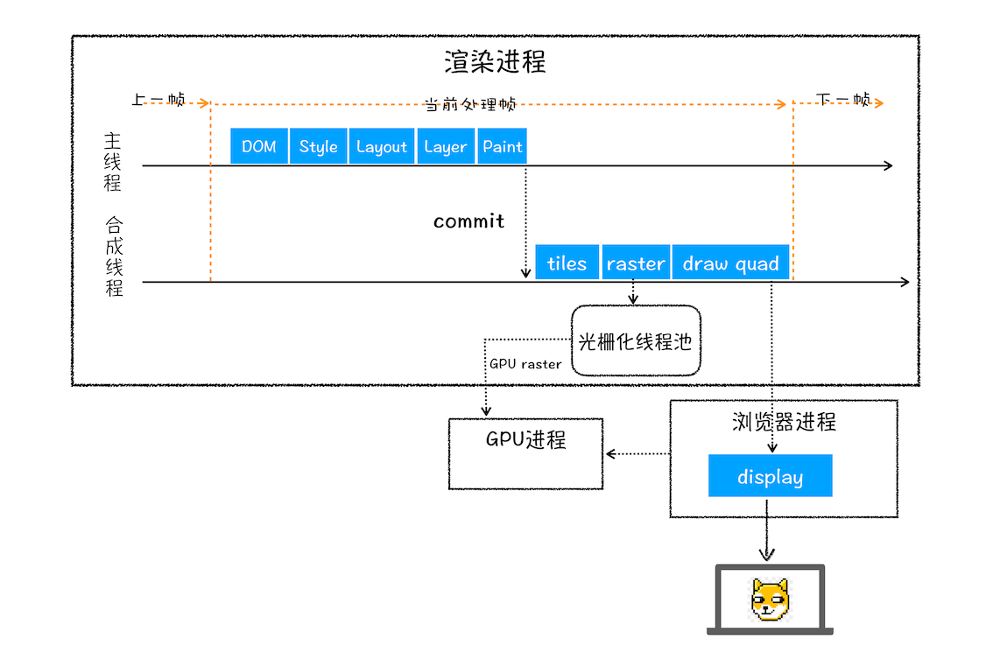
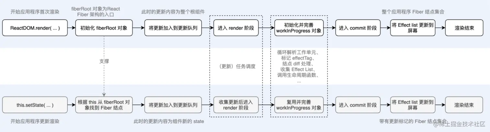

## 关于React
### 早期前端开发：解决浏览器兼容性
在前端发展的早期，最大的挑战是浏览器兼容性问题。不同的浏览器对 JavaScript 和 HTML 的支持存在差异，导致代码在不同浏览器上呈现不同结果。为了解决兼容性问题，开发者们需要针对不同浏览器编写大量的代码，这使得前端开发工作变得繁琐且效率低下。

jQuery 的出现为解决兼容性问题提供了一种有效的解决方案。jQuery 封装了常用的 DOM 操作、样式选择器、Ajax 请求等功能，并提供了统一的 API，使得开发者无需关注浏览器差异，即可轻松操作 DOM 元素、发起 Ajax 请求等。jQuery 的出现极大地简化了前端开发工作，提高了开发效率。

### 框架的兴起：组织代码结构，提高复用率
随着 PC 和移动设备性能的提升，前端开发逐渐变得更加复杂。前端应用不再局限于简单的页面展示，而是需要构建更加复杂的用户界面和交互逻辑。为了应对日益复杂的前端开发需求，各种前端框架开始涌现。

AngularJS 是最早出现的一批前端框架之一。它基于 MVC 模式，提供了路由、双向数据绑定、指令、组件等功能，帮助开发者组织代码结构，提高代码复用率。AngularJS 的出现标志着前端开发从面向过程向面向对象转变的开始。

Backbone.js 是另一款流行的前端框架。它采用了轻量级的 MVC 模式，专注于 Model、View、Controller 三个核心概念，并提供了灵活的事件驱动机制。Backbone.js 帮助开发者构建可维护、可扩展的前端应用。

### React 的诞生：组件化思想，声明式编程
2011 年，Facebook 开源了 React，一个用于构建用户界面的 JavaScript 库。React 的核心思想是组件化，将复杂的 UI 拆解为可复用的组件，每个组件负责自身的 UI 逻辑和状态管理。这种组件化思想使得代码更加清晰易懂，也提高了代码的复用率。

React 采用声明式编程范式，开发者只需描述 UI 的期望状态，React 会自动将这些状态映射到 DOM 树上，并高效地更新 UI。声明式编程使得代码更加简洁易读，也避免了繁琐的 DOM 操作。

## Virtual DOM
Real DOM，真是DOM，即文件对象模型，是一个结构化文本的抽象。

Virtual DOM, 本质上是以JavaScript对象形式存在的对DOM的描述。

## useLayoutEffect 和 useEffect 的区别
useLayoutEffect 和 useEffect 都是 React 中的 Hook，用于执行副作用，例如数据获取、订阅和 DOM 操作。但是，它们在执行时机和使用场景上有所不同。

### useLayoutEffect
- 同步执行: useLayoutEffect 在组件渲染完成且浏览器绘制更新到屏幕之前同步执行。这意味着 useLayoutEffect 内部代码可能会阻塞 UI 渲染。
- 使用场景: useLayoutEffect 通常用于需要测量 DOM 尺寸或布局的任务，或者用于更新用于影响组件布局计算的值。
### useEffect
- 异步执行: useEffect 在组件渲染完成且浏览器绘制更新到屏幕之后异步执行。这意味着 useEffect 内部代码不会阻塞 UI 渲染。
- 使用场景: useEffect 通常用于不影响组件布局的任务，例如数据获取、订阅和设置事件侦听器。
一般来说，对于大多数副作用，你应该使用 useEffect。 useLayoutEffect 仅应在需要在组件布局更新后立即执行代码时使用。

## 简要说说React的 渲染流程
### 浏览器渲染流程
一个完整的 [渲染流程](https://time.geekbang.org/column/article/118826) 大致可总结为如下：

- 1.渲染进程将 HTML 内容转换为能够读懂的 DOM 树结构。
- 2.渲染引擎将 CSS 样式表转化为浏览器可以理解 styleSheets，计算出 DOM 节点的样式。
- 3.创建布局树，并计算元素的布局信息。
- 4.对布局树进行分层，并生成分层树。
- 5.为每个图层生成绘制列表，并将其提交到合成线程。
- 6.合成线程将图层分成图块，并在光栅化线程池中将图块转换成位图。
- 7.合成线程发送绘制图块命令 DrawQuad 给浏览器进程。
- 8.浏览器进程根据 DrawQuad 消息生成页面，并显示到显示器上。
  

渲染Rendering主要是react基于组件的props和state状态，将编写的代码构建成UI界面的过程。

### [React渲染流程](https://juejin.cn/post/6959120891624030238?searchId=202405070040076EE8C9A1A0DF5037F03B)
#### 初始渲染流程

- 1.根组件的 JSX 定义会被 babel 转换为 React.createElement 的调用，其返回值为 VNode树。
- 2.React.render 调用，实例化 FiberRootNode，并创建 根Fiber 节点 HostRoot 赋值给 FiberRoot 的 current 属性
- 3.创建更新对象，其更新内容为 React.render 接受到的第一个参数 VNode树，将更新对象添加到 HostRoot 节点的 updateQueue 中
- 4.处理更新队列，从 HostRoot 节点开始遍历，在其 alternate 属性中构建 WIP 树，在构建 Fiber 树的过程中会根据 VNode 的类型进行组件实例化、生命周期调用等工作，对需要操作视图的动作将其保存到 Fiber 节点的 effectTag 上面，将需要更新在DOM上的属性保存至 updateQueue 中，并将其与父节点的 lastEffect 连接。
- 5.当整颗树遍历完成后，进入 commit 阶段，此阶段就是将 effectList 收集的 DOM 操作应用到屏幕上。
- 6.commit 完成将 current 替换为 WIP 树。

#### 构建WIP树
React 会先以 current 这个 Fiber 节点为基础，创建一个新的 Fiber 节点并赋值给 current.alternate 属性，然后在这个 alternate 节点上进行协调计算，这就是之前所说的 WIP 树。
协调时会在全局记录一个 workInProgress 指针，用来保存当前正在处理的节点，这样中断之后就可以在下一个事件循环中接着进行协调。
此时整个更新队列中只有 HostRoot 这一个 Fiber 节点，对当前节点处理完成之后，会调用 reconcileChildren 方法来获取子节点，并对子节点做同样的处理流程。
#### Fiber节点处理

创建当前节点，并返回子节点
如果子节点为空，则执行叶子节点逻辑
否则，将子节点赋值给 workInProgress 指针，作为下一个处理的节点。

这里主要说一下三种主要节点：HostRoot、ClassComponent、HostComponent

HostRoot

对于 HostRoot 主要是处理其身上的更新队列，获取根组件的元素。

ClassComponent

解析完 HostRoot 后会返回其 child 节点，一般来说就是 ClassComponent 了。
这种类型的 Fiber 节点是需要进行组件实例化的，实例会被保存在 Fiber 的 stateNode 属性上。
实例化之后会调用 render 拿到其 VNode 再次进行构建过程。
对于数组类型的 VNode，会使用 sibling 属性将其相连。

HostComponent

HostComponent 就是原生的 DOM 类型了，会创建 DOM 对象并保存到 stateNode 属性上。

#### 叶子节点逻辑
简单思考一下，叶子节点必然是一个 DOM 类型的节点，也就是 HostComponent，所以对叶子节点的处理可以理解为将 Fiber 节点映射为 DOM 节点的过程。
当碰到叶子节点时，会创建相应的 DOM 元素，然后将其记录在 Fiber 的 stateNode 属性中，然后调用 appendAllChildren 将子节点创建好的的 DOM 添加到 DOM 结构中。
叶子节点处理完毕后

如果其兄弟节点存在，就将 workInProgress 指针指向其兄弟节点。
否则就将 workInProgress 指向其父节点。

#### 收集副作用
收集副作用的过程中主要有两种情况

第一种情况是将当前节点的副作用链表添加到父节点中

returnFiber.lastEffect.nextEffect = workInProgress.firstEffect

第二种情况就是如果当前节点也有副作用标识，则将当前节点连接到父节点的副作用链表中

returnFiber.lastEffect.nextEffect = workInProgress

#### 处理副作用
从根节点的 firstEffect 开始向下遍历

before mutation：遍历 effectList，执行生命周期函数 getSnapshotBeforeUpdate，使用 scheduleCallback 异步调度 flushPassiveEffects方法（ useEffect 逻辑）
mutation：第二次遍历，根据 Fiber 节点的 effectTag 对 DOM 进行插入、删除、更新等操作；将 effectList 赋值给 rootWithPendingPassiveEffects
layout：从头再次遍历，执行生命周期函数，如 componentDidMount、DidUpdate 等，同时会将 current 替换为 WIP 树，置空 WIP 树；scheduleCallback 触发 flushPassiveEffects，flushPassiveEffects 内部遍历 rootWithPendingPassiveEffects

#### 渲染完成
至此整个 DOM 树就被创建并插入到了 DOM 容器中，整个应用程序也展示到了屏幕上，初次渲染流程结束。
#### 更新渲染流程

组件调用 setState 触发更新，React 通过 this 找到组件对应的 Fiber 对象，使用 setState 的参数创建更新对象，并将其添加进 Fiber 的更新队列中，然后开启调度流程。
从根 Fiber 节点开始构建 WIP 树，此时会重点处理新旧节点的差异点，并尽可能复用旧的 Fiber 节点。
处理 Fiber 节点，检查 Fiber 节点的更新队列是否有值，context 是否有变化，如果没有则跳过。

处理更新队列，拿到最新的 state，调用 shouldComponentUpdate 判断是否需要更新。

调用 render 方法获取 VNode，进行 diff 算法，标记 effectTag，收集到 effectList 中。

对于新元素，标记插入 Placement
旧 DOM 元素，判断属性是否发生变化，标记 Update
对于删除的元素，标记删除 Deletion

遍历处理 effectList，调用生命周期并更新 DOM。

[前端面试宝典之React篇](https://www.bilibili.com/video/BV1xk4y1h76y?p=1)

